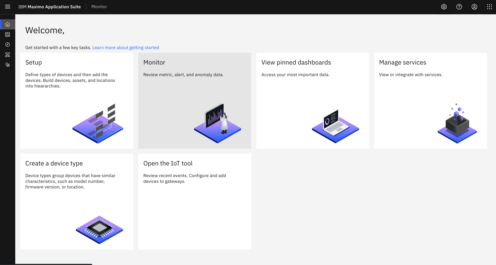
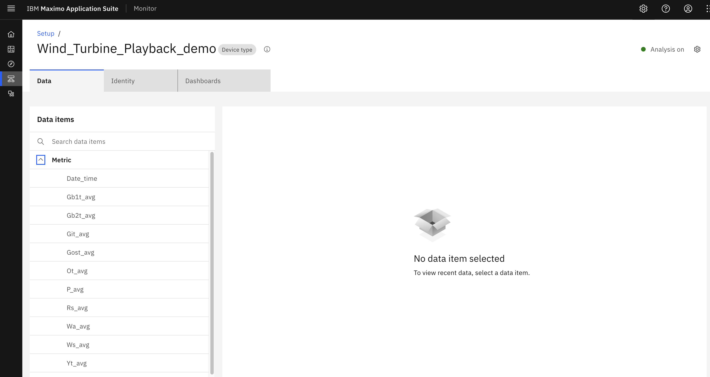
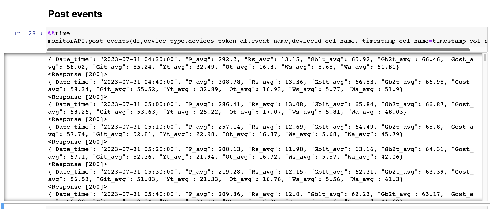
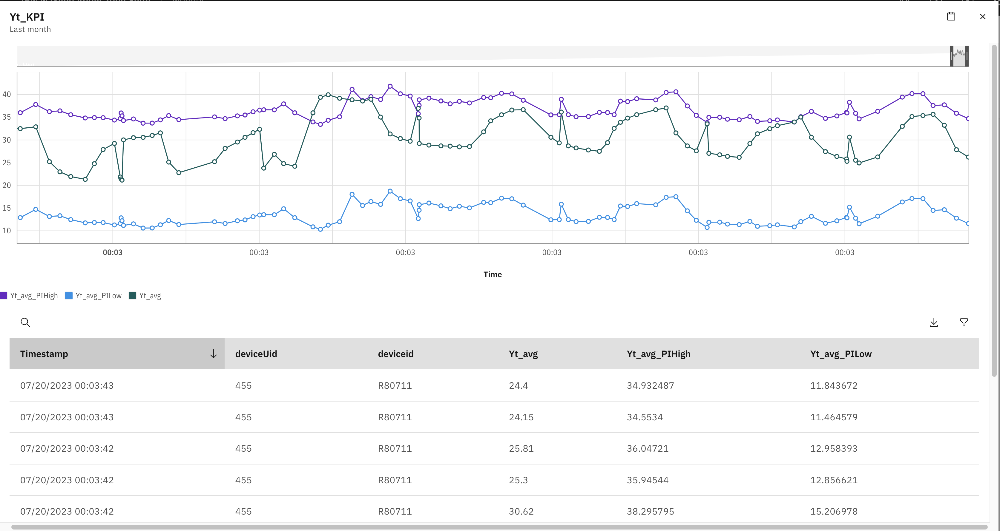

# Accelerator Demo for Maximo Monitor Application
---

## Prerequisites

1. Access to a Maximo Application Suite environment. You can find instructions on getting setup [here](http://maximo-lab.monitordemo4.ibmmam.com/apm_8.9/get_started/)

2. Access to Notebook Studio to run the cookbooks. You can find instructions to setup Notebook Studio [here](TBA)

## Repository Structure
After cloning this repository, navigate to the AI cookbooks notebooks. 

```
.
├── README.md                           <-- Instruction file
├── onboarding                          <-- Documentation for accelerator is here
│   ├── README.md                       <-- Instruction file for onboarding
├── config                              <-- Configuration files are located here
│   ├── model_factory_config.yml        <-- Configuration information for model factory setup
│   └── yt_kpi.yml                      <-- Configuration for data parameters to be provided by user
├── cookbooks                           <-- Contains runnable cookbooks to go through the flow
│   ├── Create_Monitor_Device.ipynb     <-- Cookbook to create a Device on Monitor from the data
│   ├── contextual_anomaly_deploy.ipynb <-- Cookbook to deploy the KPIs after training and device creation
│   └── contextual_anomaly_train.ipynb  <-- Cookbook to train contextual anomaly model on the data using config
└── data                                <-- Raw data files
    ├── Wind_Turbine.csv                <-- Entire sample wind turbine dataset
    ├── Wind_Turbine_test.csv           <-- Unseen test set for inference
    └── Wind_Turbine_train.csv          <-- Training data used in the contextual anomaly notebook as example

5 directories, 10 files
```

## 1. Prepare data
---

1.  Prepare dataset with `timestamp` column, `asset id` column and `feature` columns
2.  Split it for `training` and `inference`
3.  Refer it to create the [yaml](../config/yt_kpi.yml) file for input params - upload to cp4d as well as notebook folder

    [](image.png)
    
    In this `config` file, below are the details of the parameters that need to be set:
    
    | Parameter           | Description                                                                                                             |
    |---------------------|-------------------------------------------------------------------------------------------------------------------------|
    | asset_id_column     | The column in your data which represents the ID of the asset or device name.                                          |
    | data_name           | The file name of the data that is to be used for training. If you are uploading on Watson Studio, the file name remains the same, but the prefix would change. |
    | device_description  | A description of your device type to publish to Monitor, while creating a device.                                      |
    | device_type         | The name of the asset group or device type, which is used to create a device type in Monitor.                         |
    | feature_columns     | The feature columns to use for training and inference.                                                                 |
    | feature_names       | Human readable names of the feature columns to be used to display them on Monitor.                                    |
    | target_columns      | The target column used for training. In contextual anomaly recipe, this is the column that will be used to predict upper and lower bound for it, based on the feature columns. |
    | target_names        | Human readable names of the target columns to be used to display them on Monitor.                                    |
    | timestamp_column    | Name of the column which contains the timestamps for your records.                                                    |
    | timestamp_format    | Format of the timestamp to be used to interpret them.                                                                  |
    | inference_data_name | File name of the dataset to be used for inference.                                                                     |


    ### Recommendations on data preparation
    1. Ensure the data has no null values, as streaming data to monitor expects non-null values. You may either drop the null rows, or impute them.
    2. For the sample data size of 10k, the overall training process takes around 5 minutes, and the inference takes around 5 minutes as well. The larger the data, the longer it would take to run training and inference.
    3. The timestamp column should be in a standard format, which is also to be provided in the config file. 
    4. If multiple assets are present in the data, they will be sent under different device names to monitor in terms of setup. However, the same KPI model will be deployed to each of these devices for inference.

## 2. Training
---

1.  Update the file name of the KPI yaml in [contextual training](cookbooks/contextual_anomaly_train.ipynb) notebook
2.  Run [contextual anomaly train](cookbooks/contextual_anomaly_train.ipynb) notebook, which calls the model factory service to run training on contextual anomaly recipe
3.  Monitor the result of the API, and save the result to a yaml file, by running the last 2 cells of the notebook

## 3. Creating monitor device
---
1.  While it runs, run the [Create Device Monitor](cookbooks/Create_Monitor_Device.ipynb) notebook after yaml file for kpi is uploaded
2.  Go to [monitor](https://tenant1.home.masinst1.ibmmam.com/) to verify if device is created <break>
    a. 
    b. You can find the device under the `device_type` that we provided in the yaml config file: 
    c. You can also verify that the feature columns are setup correctly, through the `setup` page: 
3.  Come back to train notebook and save the model_info output to yaml

## 4. Deployment of KPIs
---
    
1.  Run [contextual anomaly deploy](../cookbooks/contextual_anomaly_deploy.ipynb) notebook to deploy the KPIs after the training and device creation are completed. In this example cookbook, we are deploying a KPI called `Efficiency`.
2.  Go to monitor, verify that the KPIs are created [https://tenant1.monitor.masinst1.ibmmam.com/monitor](https://tenant1.monitor.masinst1.ibmmam.com/monitor)
 [](kpi_config.png)
3.  Add a dashboard from monitor to represent the KPIs along with input sensors <break>
    3.1. Click the `Add dashboard` button on the setup page under the dashboards tab.
    
    3.2. Pick a title, select `Time series line` and configure the metrics to display on the dashboard. Pick the KPIs from the model, along with the name of the raw variable (sensor), then `Save and close`.
    

4.  Go back to create device notebook to pump data again - it's only the last cell
    
5.  Wait for 4-5 mins, till the streaming metrics get called
6.  Check dashboard to see the displayed data after the KPIs are run. On clicking the dashboard, (not on the setup page, on Monitor) you can see the three lines in the chart that we configured in the previous step. 

Here, the purple line(`Yt_avg_PIHigh`) signifies the upper bound, and the blue line(`Yt_avg_PILow`) signifies the lower bound, both of which are the derived by the contextual anomaly model. To understand this chart, we essentially note the green line, which is `Yt_avg`, which is the target variable, to monitor whether it falls between the lower and upper bound predicted by the model. The points where the raw data is out of bound, is a predicted candidate for anomaly selected by the model.


## Bring your own data
---
    
To explore our capabilities with your custom data, adhere to the following steps:

1. Put your data in the `data/` folder.
2. Revise the `KPI yaml` config file to include the pertinent information related to your data.
3. Continue with the subsequent steps in a similar manner.
4. While creating a device on `Monitor`, ensure to furnish a new device name.
